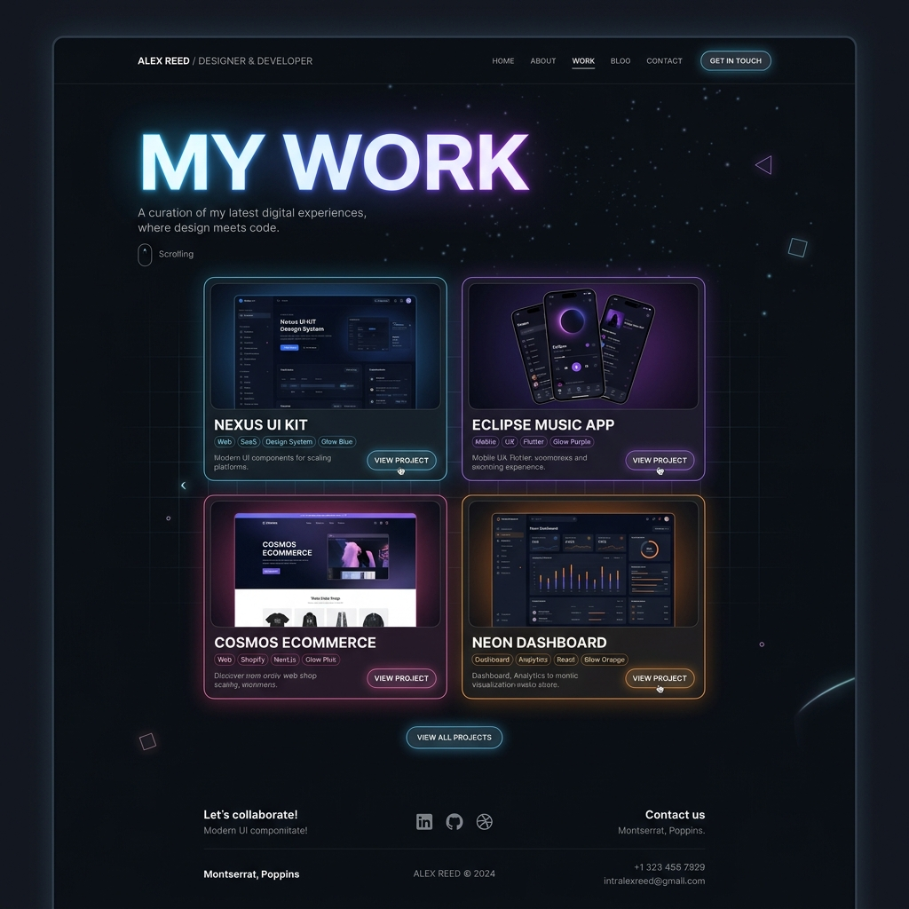

# Website Creation HUB

This repository contains a web application built with HTML, CSS, and JavaScript.

## Open the Website

To view the website locally, you can use the provided bash script, which starts a local Python HTTP server and automatically opens your default browser.

1. Open your terminal.
2. Navigate to the project directory.
3. Ensure the script is executable (if it isn't already):
   ```bash
   chmod +x open_web.sh
   ```
4. Run the script:
   ```bash
   ./open_web.sh
   ```

Alternatively, if you have Python 3 installed, you can start the server manually by running:
```bash
python3 -m http.server 8080
```
Then open `http://localhost:8080` in your web browser.

## What Do We Offer!?

We specialize in crafting beautiful and functional websites tailored to your specific needs. Check out some of our offerings:

### Birthday Websites
Celebrate life's milestones with vibrant and joyful designs!


### Love & Anniversary Websites
Immortalize your precious moments with an elegant aesthetic!


### Business Websites
Establish a strong and professional corporate presence!


### And More! (E.g. Portfolios)
Sleek, modern, and dark-mode designs perfect for showcasing your creative work! Dream It And We'll Make It Come True!

