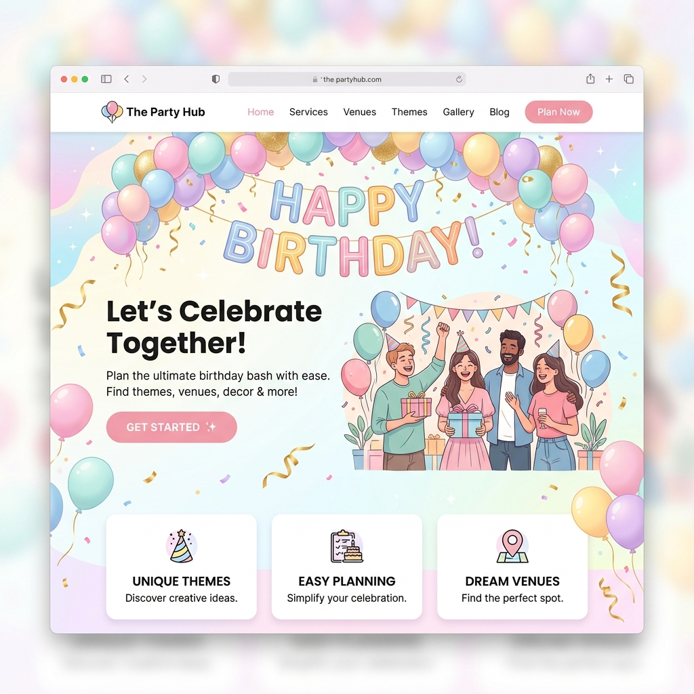

# Website Creation HUB

This repository contains a web application built with HTML, CSS, and JavaScript.

## How to Run the App

Because this application uses a custom Python backend with a SQLite database for secure user authentication (Login/Signup), you **must** run the provided custom server. 

Do **not** use the default static `python -m http.server`, as it will not process the `/api/signup` or `/api/login` backend handlers!

**Follow these exact steps:**

1. Open your terminal.
2. Navigate to the project root directory.
3. Start the backend server by running:
   ```bash
   python backend/server.py
   ```
   *(Note: Depending on your system configuration, you may need to use `python3` instead of `python`)*
4. The server will initialize your `users.db` SQLite database automatically if it doesn't exist yet.
5. Open your web browser and go to: `http://localhost:8080`

*(If you were previously using `open_web.sh`, you will now find it inside the `/scripts/` directory. Make sure it points to `python backend/server.py` if you prefer using it).*

## What Do We Offer!?

We specialize in crafting beautiful and functional websites tailored to your specific needs. Check out some of our offerings:

### Birthday Websites
Celebrate life's milestones with vibrant and joyful designs!


### Love & Anniversary Websites
Immortalize your precious moments with an elegant aesthetic!


### Business Websites
Establish a strong and professional corporate presence!


### And More! (E.g. Portfolios)
Sleek, modern, and dark-mode designs perfect for showcasing your creative work! Dream It And We'll Make It Come True!

